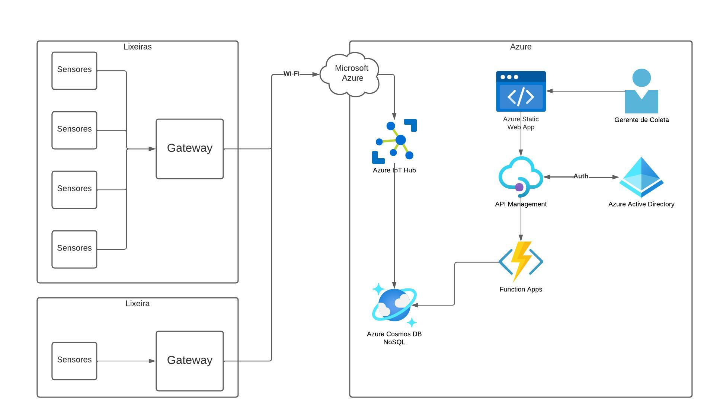

# cata-sucata architecture

### Sensores de lixeira

Os sensores de lixeira são responsáveis por avaliar o estado a ser observado da lixeira, para este protótipo, utilizamos um sensor ultrasônico, que verificava a distância entre o fundo da lixeira até sua tampa (onde o sensor ficaria posicionado). Dessa forma, é possível prever quando uma lixeira estará cheia ou vazia.

### Gateways

Os dados por sua vez são coletados por um gateway (que nesse protótipo se tratava de um Microcontrolador NodeMCU ESP8266). Este gateway possui um formato de comunicação de redes de sensores sem fio, em específico é utilizado o padrão WiFi para se conectar a internet. A partir disso, o microcontrolador se conecta a nuvem.

### Nuvem da Azure

A nuvem da Azure, é uma nuvem pública de serviços de internet, criada e mantida pela Microsoft. Para esse projeto, exploramos a nuvem da Microsoft Azure, por se tratar de um espaço que disponibiliza custo zero até um certo limite de mensagens processadas por dia. O que acabou se tornando realidade ao finalizar o projeto, sem pagar um centavo pelo formato de comunicação.

### Azure IoT Hub

É o serviço de comunicação com dispositivos IoT, este por sua vez cria as credenciais e chaves de comunicação, para que a comunicação ocorra de forma criptografada, através do protocolo MQTT. Assim, é possível estabelecer uma porta de entrada com os dispositivos gateway e a nuvem da Azure.

### Azure Cosmos DB (NoSQL)

O Azure Cosmos DB é um banco de dados NoSQL Serverless da Azure que permite armazenar dados não estruturados para aplicações. Esse serviço será utilizado para armazenar os dados dos sensores, visto que, os sensores podem enviar diversos tipos de estruturas de dados.

### Azure App Functions

O Azure App Functions é o serviço de Plataforma como serviço de funções serverless que é utilizado para rodar funções na nuvem. Em específico, serve como um back-end de microserviços (funções) onde cada função pode estar relacionado com uma funcionalidade para uma API; que é o nosso caso, as funções estão integradas a API para obter informações dos sensores.

### Azure API Management

A Azure API Management é o serviço de API da Azure, que providencia um endereço de consulta de API para que serviços de front-end possam consultar as informações e montar lógicas de rotas, na conexão entre front-end e back-end.

### Azure Active Directory

O Azure Active Directory é um diretório de gerenciamento de acesso e identidade baseada em nuvem, ele irá permitir a autenticação de usuários no front-end para terem acesso à API.

### Azure Static Web App

O Azure Static Web App é o serviço de hospedagem de Web Apps Estáticos, com ele é possível hospedar nosso website na nuvem utilizando apenas artefatos estáticos. Com ele, nós fazemos o build do React e transformamos o front-end em artefatos estáticos (HTML, Css e JS). Por fim, esse serviço disponibiliza um endpoint para acessar o site estático.