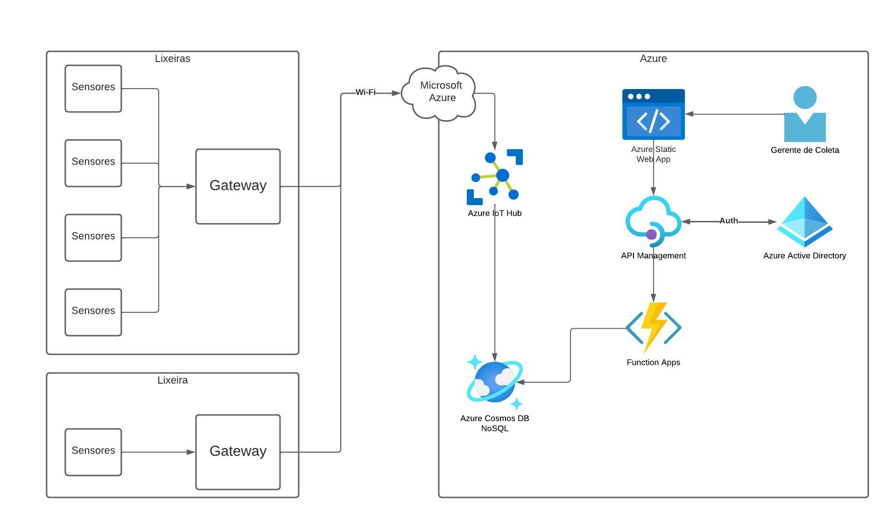

# cata-sucata

## Arquitetura da Infraestrutura

Nativamente o Cata-Sucata é um aplicativo totalmente baseado em serviços de Nuvem Serverless, totalmente gerenciado pela Nuvem da Azure.

Mais informações em [ARCHITECTURE.md](./ARCHITECTURE.md).